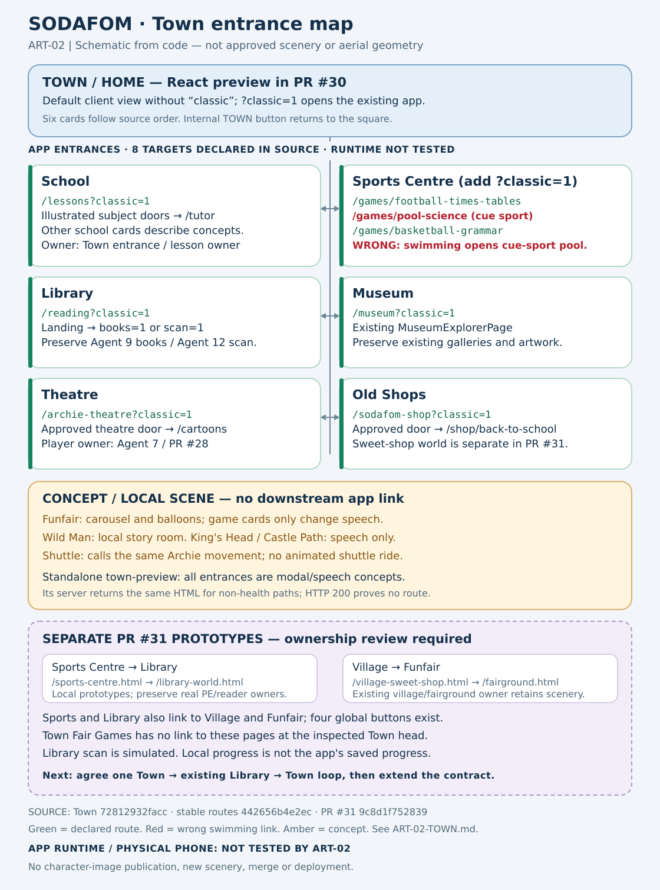

# ART-02 — Town entrances and connected-world handoff

Prepared for Michael Davis and Coordinator Codex on 16 September 2026.

**ART-02 is the new numbered Town coordination lane. The existing Town owner retains issue #29 / PR #30.** This report and the route-map SVG are the only files owned by ART-02. No application files were changed.

**Status: AMBER — eight real route targets exist in the React town prototype; the standalone town is a concept preview. Full connected-world movement and device acceptance remain incomplete.**

**RED defect: the Swimming Pool entrance opens cue-sport Pool Science (🎱, six pockets), not swimming.** A registered route can still be the wrong destination. Town and the game owner must correct this before a child swimming walkthrough is accepted.

## Exact source and delivery state

| Item | Verified reference |
| --- | --- |
| Repository | `drmichael1982-crypto/Sodafom.uk` |
| Town branch / PR | `codex/sod-town-01-connected-town-pe-20260915` / [PR #30](https://github.com/drmichael1982-crypto/Sodafom.uk/pull/30) |
| Town code inspected | `72812932facc1baed2589a9769e1c8924df70005`; PR metadata was read back and matches this head |
| Town base, inherited routes and worlds | `codex/stable-app-build-20260915` / `442656b4e2ec76167b4d0b5fb7b804cf742904a5` |
| Separate village/funfair/sports/library prototype | `codex/fairground-world-walkthrough` / [PR #31](https://github.com/drmichael1982-crypto/Sodafom.uk/pull/31) at `9c8d1f7528394c97fe351d81ce38df6883108f57` |
| Shared written artwork reference | [PR #33](https://github.com/drmichael1982-crypto/Sodafom.uk/pull/33), `cbe4a727b2edd561fcc29d024844ca920904e1dc`; private pack README, work order, Michael master and scene-status manifest read |
| Report working branch | `codex/artwork-coordination-20260916`, based on stable commit above; ART-02 has not committed or pushed |
| Report files | `docs/artwork/coordination/ART-02-TOWN.md`; `docs/artwork/coordination/ART-02-town-route-map.svg` |

PR #30 changes exactly six files: `src/App.tsx`, `src/pages/OrfordTownPreviewPage.tsx`, and `town-preview/{Dockerfile,index.html,package.json,server.mjs}`. It does not change `src/routes.tsx`, `ApprovedArtworkPage.tsx`, the reader, game implementations or theatre. The inherited files were read from the clean stable checkout.

## Route map

The SVG is a **route schematic, not an approved aerial landscape or replacement scenery**. Its six entrance cards follow the source's place order and two-column phone layout. The source supplies no surveyed paths, building footprints or approved aerial geometry, so none is invented. Green marks a route declared in source; it does not certify a working game, finished artwork or phone test.

## Actual React town entrances

The town's `openExisting()` produces `<path>?classic=1` in a normal browser. In Capacitor it produces `<current pathname>?classic=1#<path>`. The URL column below is the normal-browser form.

| Town area / scene | Actual destination URL | What that destination is in source | Ownership / remaining work |
| --- | --- | --- | --- |
| Home / town | Initial scene `town`; default client view without the `classic` parameter | Town page over `home-landscape-v2.png`; six entrance buttons and extra fair/legend buttons. `/?classic=1` opens the existing approved Home world. | Town owner owns navigation. A separate walkable family home is not implemented here. Preserve approved Home artwork. |
| School → Open Lessons | `/lessons?classic=1` | Existing illustrated classroom; subject hotspots lead to `/tutor?subject=...&direct=1`. Other three school cards speak descriptions. | Town owns the entrance. Existing lesson owner owns lessons. PE hotspot still targets tutor; it is not proof of a full PE world. |
| Sports → Football | `/games/football-times-tables?classic=1` | Existing learning-arena maths game, with question/action/result code | Town owns Sports entrance; reuse existing game/progress contracts. Full football PE curriculum is a separate unfinished acceptance item. |
| Sports → Swimming | `/games/pool-science?classic=1` | **WRONG DESTINATION:** cue-sport Pool Science, with six pockets and a ball-potting action | **RED / high priority:** Town + game owner must provide the real swimming destination or an honest unavailable state. Do not rename the existing cue-sport game as swimming. |
| Sports → Indoor hall | `/games/basketball-grammar?classic=1` | Existing learning-arena grammar game | This is not evidence of complete gym, balance, agility or indoor PE lessons. |
| Library → Walk Inside | `/reading?classic=1` | Existing `ReadingPage` landing; Book Collection opens `/reading?books=1`, scanner opens `/reading?scan=1` | Preserve Books/library Agent 9 and scanner Agent 12 under #20. Town should provide entrance/return only. |
| Museum → Walk Inside | `/museum?classic=1` | Existing `MuseumExplorerPage` | Preserve galleries and existing topics; do not replace their environment with this schematic. |
| Theatre → Walk Inside | `/archie-theatre?classic=1` | Approved theatre entrance; its hotspot opens `/cartoons` / `CartoonTheatrePage` | Preserve Agent 7 / #21 / PR #28 shared player and media ownership. Town links to it. |
| Old Shops → Walk Inside | `/sodafom-shop?classic=1` | Approved shop entrance; its hotspot opens `/shop/back-to-school` | Existing destination is the school shop. This does not yet join the #31 Victorian sweet-shop walk or demonstrate every planned shop. |
| Fairground | Internal scene `fair`; **no downstream route** | Animated carousel/balloon decorations; Carousel, Fair Games, Balloons and Surprises cards only change speech | Coordinate one entry to #31's fairground after ownership/interface review. No game launch from this scene is implemented. |
| Wild Man | Internal scene `wildman`; **no downstream route** | Local legend display and spoken story | Existing local room; a gallery/castle link remains to be agreed with Museum owner. |
| King's Head / Castle Path | **No scene or route change** | Buttons only change speech | Frontage/castle adventure remain concepts at these controls. |

Source: [OrfordTownPreviewPage.tsx at the exact Town head](https://github.com/drmichael1982-crypto/Sodafom.uk/blob/72812932facc1baed2589a9769e1c8924df70005/src/pages/OrfordTownPreviewPage.tsx), [inherited route table](https://github.com/drmichael1982-crypto/Sodafom.uk/blob/442656b4e2ec76167b4d0b5fb7b804cf742904a5/src/routes.tsx), [Pool Science's cue-sport configuration](https://github.com/drmichael1982-crypto/Sodafom.uk/blob/442656b4e2ec76167b4d0b5fb7b804cf742904a5/src/lib/games/learning-arena-data.ts), [approved-artwork hotspots](https://github.com/drmichael1982-crypto/Sodafom.uk/blob/442656b4e2ec76167b4d0b5fb7b804cf742904a5/src/pages/ApprovedArtworkPage.tsx).

## Movement and return findings

- Six `PLACES` entries target horizontal Archie positions 12, 28, 45, 61, 75 and 88 percent. The main grid changes from two to three to six columns at responsive breakpoints. These percentages are animation targets, not validated door coordinates.
- `walkTo()` tweens Archie along the lower edge and switches scene after 760 ms. It is not a pathfinding/doorway system. It allows multiple pending timers when destinations are tapped repeatedly; a rapid-tap/cancellation check belongs in the owner's next test.
- The internal **TOWN** button resets scene and position immediately. The eight outgoing links perform full navigation. No explicit town-return state or reverse walking animation is passed into existing systems.
- The shuttle closes its chooser and calls the same `walkTo()`; there is no rendered shuttle-ride sequence. Its destination list contains the six places plus Wild Man, and omits Fairground.
- Local speech synthesis is used. The town supplies no shared audible-speaking state to `ArchieCharacter`, and walking demos use generic child emoji. This is not final character animation, fixed Michael voice or a rigged 3D world.
- Town-level reduced-motion checks exist, but the inherited `ArchieCharacter` still defines its own infinite motion without reading that preference. There is no town-wide pause/mute control in this source. These are source findings; actual motion/audio behavior requires ART-06/owner browser checks.
- `App.tsx` selects Town whenever the client URL lacks a `classic` parameter, regardless of pathname. Existing in-app links do not consistently carry it onward. Direct loads/refreshes and returns therefore need a deliberate routing contract before integration; route registration alone does not establish those journeys.
- The current `openExisting()` blindly appends `?classic=1`. Its eight current inputs contain no query, but a new direct shelf link must preserve both parameters, for example `/reading?books=1&classic=1`, rather than appending a second `?`. The same applies to `scan=1` and subject/query links. Check the browser and Capacitor forms separately.

Source: [Town App gate](https://github.com/drmichael1982-crypto/Sodafom.uk/blob/72812932facc1baed2589a9769e1c8924df70005/src/App.tsx), [ReadingPage choices](https://github.com/drmichael1982-crypto/Sodafom.uk/blob/442656b4e2ec76167b4d0b5fb7b804cf742904a5/src/pages/ReadingPage.tsx), [inherited Archie component](https://github.com/drmichael1982-crypto/Sodafom.uk/blob/442656b4e2ec76167b4d0b5fb7b804cf742904a5/src/components/ArchieCharacter.tsx).

## The standalone Town preview is different

`town-preview/index.html` has the same six broad entrance names but opens modal cards and speech. **Its Enter Lessons / Existing Games controls describe future connections; they do not navigate to app routes.** Library, Museum, Theatre and Shops are also concept modals. The shuttle cards speak and do not take the child to a destination.

`town-preview/server.mjs` returns that same HTML for every request except `/health`. A 200 response at `/reading`, `/cartoons` or a made-up path on this standalone server would therefore not prove those pages exist. Same-origin links cannot turn this server into the real app.

Source: [standalone HTML](https://github.com/drmichael1982-crypto/Sodafom.uk/blob/72812932facc1baed2589a9769e1c8924df70005/town-preview/index.html), [standalone server](https://github.com/drmichael1982-crypto/Sodafom.uk/blob/72812932facc1baed2589a9769e1c8924df70005/town-preview/server.mjs).

## PR #31 overlap to resolve before integration

| Separate prototype | Verified connection / behavior | Required owner boundary |
| --- | --- | --- |
| `public/village-sweet-shop.html` | Links to Home and `/fairground.html`; separate street/sweet-shop prototype | Preserve #31 village and sweet-shop work; Town must connect an agreed entrance and return, not redraw the village. |
| `public/fairground.html` | Links to Home, maths/reading/spelling hubs, science lab and skeleton builder | Preserve #31 fairground owner; one agreed town entry is still missing in PR #30. |
| `public/sports-centre.html` | Links to Village, Library and Funfair; a three-question local unlock object moves emoji actors | Conflicts in scope with Town #29 Sports Centre. Reuse agreed scenery only; keep real arena/progress and future PE work under its established owners. |
| `public/library-world.html` | Links to Sports, Funfair and Village; local word gate, timer highlights, **Simulate book scan** | Preserve Agent 9 Books and Agent 12 scanners. The prototype does not call the real reader/scanner or narrate its displayed story. Repeated scan/read actions can increase its local counter. |
| `public/sodafom-world-entry.js` | Adds four fixed global buttons: Library, Sports, Village, Funfair | Global navigation overlap with Town. Coordinator should choose one entry surface and request only the needed shared-shell change. |

All five files were read at `9c8d1f7528394c97fe351d81ce38df6883108f57`. [Sports source](https://github.com/drmichael1982-crypto/Sodafom.uk/blob/9c8d1f7528394c97fe351d81ce38df6883108f57/public/sports-centre.html), [Library source](https://github.com/drmichael1982-crypto/Sodafom.uk/blob/9c8d1f7528394c97fe351d81ce38df6883108f57/public/library-world.html), [global prototype entries](https://github.com/drmichael1982-crypto/Sodafom.uk/blob/9c8d1f7528394c97fe351d81ce38df6883108f57/public/sodafom-world-entry.js).

## Smallest next Town work order

**Proposed owner: existing Town #29 / PR #30; acknowledgement is still required.** ART-02 does not claim to have started that external session.

**First fix the wrong Swimming destination.** Town and the game owner must agree a real water-swimming activity before wiring that entrance. No true swimming route was established by this review. Until then, show a clear unavailable/coming-soon state instead of launching cue-sport Pool Science. Do not use the #31 three-question prototype as proof of complete swimming lessons.

1. **Close one real loop first: Town → Library landing → existing book collection → Town.** Keep `/reading` and its `books=1` option as the functional interfaces, preserve all query parameters, and agree only the entrance/return contract with Agent 9. Keep Agent 12's scanner logic untouched. Record a tested commit and exact browser URL, including a refresh inside the book view.
2. Reuse that route/return contract for the other seven existing targets. Preserve School's subject hotspot layer, the Theatre entrance → shared player and school-shop destination. Request narrowly owned changes to shared `App.tsx`/route navigation through Coordinator Codex; avoid a global uncoordinated rewrite.
3. Use the React town as the candidate app integration surface for review. Keep the standalone preview explicitly visual-only until a verified real app review URL is available. If it needs functional links, replace speech-only controls with links to that verified app URL and the route mapping above; do not fabricate same-origin destinations on the standalone HTML server.
4. Ask #31's existing owner for the single supported Village/Sweet Shop/Funfair entrance and a return to Town. Add that agreed connection to the existing Fair Games entry; preserve their world files. Hold #31 Sports/Library promotion until Town, Agent 9 and Agent 12 settle ownership and functional interfaces.
5. With navigation stable, map Archie to the actual rendered doorway coordinates, cancel stale navigation timers, and add arrival/return movement using the agreed shared animation interface. Route reduced motion and pause through that interface; request shared-character changes from its owner.
6. Treat complete football/swimming/indoor PE lessons and saved reporting as remaining #29 work. Existing themed maths/science/grammar games and three-question prototypes must not be marked as completed PE curriculum.

Keep Michael's approved portrait as the identity authority, Archie/Rob/Soda consistent, Jessica jet-black with only a tiny white chin, Sally entirely jet-black and Daisy brown/white. Keep the approved settings and established voices. This report adds no portrait/image bytes and creates no replacement character design.

## Validation and limits

| Check | Result | Meaning |
| --- | --- | --- |
| Exact Town head + six changed filenames | PASS | Read directly from GitHub PR metadata and file list |
| Eight `openExisting()` targets declared in inherited route table | PASS — 8/8 | Static Python extraction and comparison; **not** eight completed journeys |
| Swimming entrance opens a swimming activity | FAIL — source-confirmed wrong destination | It opens Pool Science's 🎱 pocket-selection game; runtime execution is not needed to establish this mapping defect |
| Downstream `/tutor`, `/cartoons`, `/shop/back-to-school` declarations | PASS — 3/3 | Route and hotspot source inspection |
| Standalone functional app entrances | NOT IMPLEMENTED IN SOURCE | Modal/speech controls and HTML-only server inspected |
| SVG syntax and render | PASS | XML parsed; Inkscape rendered PNG; full rendered image visually inspected; no clipping observed; zero image or script elements |
| App build, runtime clickthrough, audible playback, real scanner, saved progress | NOT TESTED by ART-02 | No app execution or passing runtime claim |
| Phone/foldable/tablet layouts | NOT TESTED by ART-02 | ART-06 owns cross-world requirements; owner must supply executed checks |
| Physical Honor phone / other physical device | NOT TESTED | No physical-device access or claim |
| Main/master merge, deployment, Systems 797, public reference-image upload | NOT PERFORMED | No application or production mutation |

No main/master merge, deployment, force push, application edit or private image publication was performed. Coordinator Codex owns publication of these text/vector deliverables.
